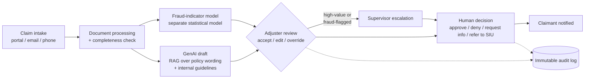

# Claims Copilot: Responsible Generative AI for Motor Insurance

An M.Sc. group project on a generative-AI copilot that supports motor insurance claims handling,
together with a Responsible AI assessment of whether it should be trusted with a real claim.

**The AI never makes the decision.** It drafts; a human adjuster decides.

## The problem

Every motor claim requires an adjuster to work through police reports, repair estimates, medical
documentation and the policy wording, then draft a rationale largely from scratch. That is the
bottleneck the copilot targets.

The people the decision lands on, claimants and third parties, never interact with the AI and have
almost no visibility into how it shaped their outcome. A system that is faster but less fair, or
more efficient but less accountable, is therefore not a neutral trade-off: it moves risk onto the
people least able to see or contest it.

## How a claim moves through the system

- **Fraud detection is kept separate from text generation.** The fraud indicator is a structured
  statistical model, not the generative model.
- **Grounded generation.** Drafts are produced with retrieval-augmented generation over the
  claimant's actual policy and the insurer's guidelines, with an evidence-citing rationale.
- **Overrides are logged with a reason**; high-value and fraud-flagged claims escalate to a
  supervisor.
- **The boundary is architectural, not a policy promise.** The AI has no permission to approve a
  claim, authorise a payout or contact the claimant.

## Responsible AI assessment

### Stakeholders

| Influence over the system | Operate it | Affected by it |
| --- | --- | --- |
| Executive and claims management, AI development team, compliance, DPO, risk management, internal audit | Claims adjusters and supervisors | Claimants and third parties (other driver, witnesses, treating physicians) |

Three tensions run through the assessment: **efficiency vs. fairness**, **fraud prevention vs.
privacy**, and **automation benefit vs. accountability**. In the last one, the adjuster risks
becoming a *moral crumple zone*, formally responsible for a decision they did not originate.

### Ethics: five lenses, one convergence

| Lens | What it surfaces |
| --- | --- |
| Utilitarianism | Efficiency gains are real, but the harm of a false fraud flag and the benefit of speed land on different groups. |
| Deontology | The architecture keeps a human decision-maker, but automation bias can hollow out that duty in practice. |
| Virtue ethics | Design can support practical wisdom under caseload pressure; it cannot manufacture it. |
| UDHR Art. 7, 8, 12 | Non-discrimination (fraud-model bias), effective remedy (explanation mediated twice), privacy (health data in plain-language summaries). |
| Ubuntu | Does the system sustain the insurer–adjuster–claimant relationship, or reduce it to a rubber stamp? |

All five converge on one question: **does the claimant stay visible in the process?**

### Regulation

- **EU AI Act.** Annex III lists life and health insurance risk assessment and pricing as
  high-risk; it does not name motor claims handling. Classification is genuinely open. If
  high-risk, Art. 14(4)(b) (awareness of automation bias) applies directly. Art. 26 deployer
  obligations apply regardless.
- **GDPR.** A DPIA is very likely mandatory (Art. 35). Art. 22 turns on the CJEU *SCHUFA* test:
  whether the adjuster's decision "draws strongly upon" the AI's draft, which depends on use,
  not design. Art. 25 (data protection by design and by default) anchors the privacy safeguards.

### Risk priorities

1. **Automation bias.** The precondition for several other risks, and invisible in the audit
   log: a rubber-stamped acceptance looks identical to a scrutinised one.
2. **Accountability gap.** Already a structural fact, not a hypothetical; it leaves errors
   uncorrected.
3. **Unfair fraud detection.** Uncertain likelihood, severe harm, borne by the most vulnerable.
4. **Explainability** and **privacy misuse**, the next tier.

### Human-in-the-loop is not human-in-control

The workflow guarantees a human *in the loop*. It cannot, by design alone, guarantee a human
*in control*. The adjuster sees the draft, the fraud flags and the recommendation before forming
an independent view, which anchors their judgement. A low override rate looks the same whether
the AI is accurate or reviewers have stopped checking.

The same problem appears in explainability as the **citation-versus-causation gap**: a rationale
can cite a real clause without that clause being why the model reached its recommendation. This
is framed as an evidence gap to close in operation, not a confirmed failure.

### Fairness, privacy and sustainability

- **Fairness.** Aggregate accuracy can hide a higher false-positive rate for one group. Primary
  metric: **false-positive rate by subgroup**. Retraining on outcomes of AI-influenced
  investigations risks a feedback loop. The evidence to confirm or rule this out does not exist
  yet, and that absence is the finding.
- **Privacy and security.** RAG grounding reduces hallucinated coverage terms but does nothing
  for automation bias or fairness. Prompt injection via submitted documents could leak another
  claimant's data. Access should be role-based by data sensitivity, and AI-generated summaries
  need the same access controls as the records they are built from.
- **Sustainability.** An illustrative estimate of about 10.6 kg CO₂e per model update, under
  stated assumptions (not a measurement). Main Green AI lever: a smaller, task-specific model.

### Governance

No existing function owns GenAI-specific risk for this system. Proposed mechanisms:

- **Ownership** distributed across existing functions, plus a new coordinating **AI Governance
  function**.
- **Joint deployment sign-off** by Legal & Compliance, the DPO, model risk and the AI Governance
  function.
- **One monitoring programme**: override and acceptance rates, subgroup fairness metrics,
  access-log audits, and unannounced review of *accepted* recommendations.
- **Incident response** with defined triggers (fairness disparity, privacy incident, misleading
  rationale) and named authority to pause the affected component.

A RACI matrix covers nine governance activities.

### Path to deployment

1. **Pre-deployment validation**: subgroup fairness testing with pre-set pass/fail criteria, a
   scoped DPIA, rationale-vs-reasoning testing, prompt-injection security testing.
2. **Restricted pilot**: limited adjusters, special-category and fraud-flagged claims excluded,
   lower escalation threshold.
3. **Limited rollout → full deployment → ongoing monitoring**, each stage earned by evidence.

Review time is a governance control to protect, not a cost to flex against throughput targets.

## Verdict

> A plausible and defensible Responsible AI design, but responsible deployment is not yet
> confirmed until evidence, governance and monitoring requirements are demonstrated.

The legal analysis, the five ethical lenses and the technical risk analysis each reach this
conditional answer independently.

## Repository contents

| Path | Contents |
| --- | --- |
| `docs/presenter-script.md` | 12-slide presentation script (~11.5 min, three speakers) |

## Status

Repository set up; the presentation script is in `docs/`. The implementation and the full
report will be added here.
