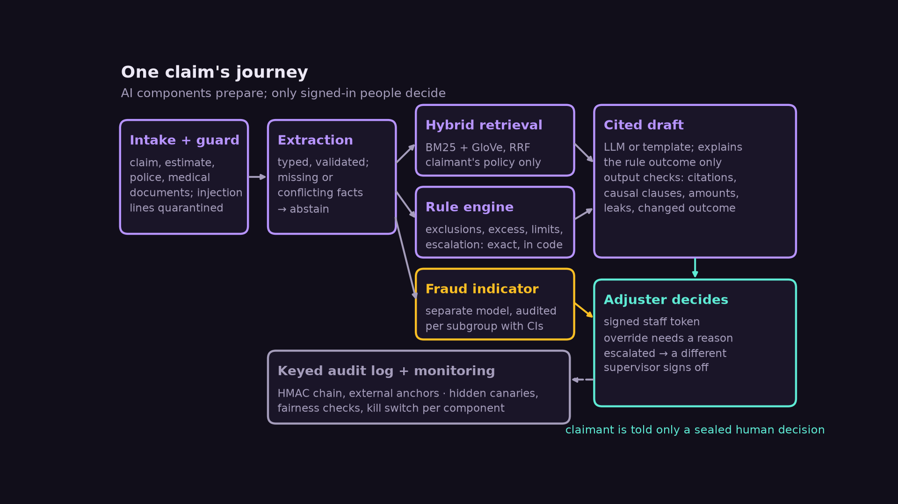
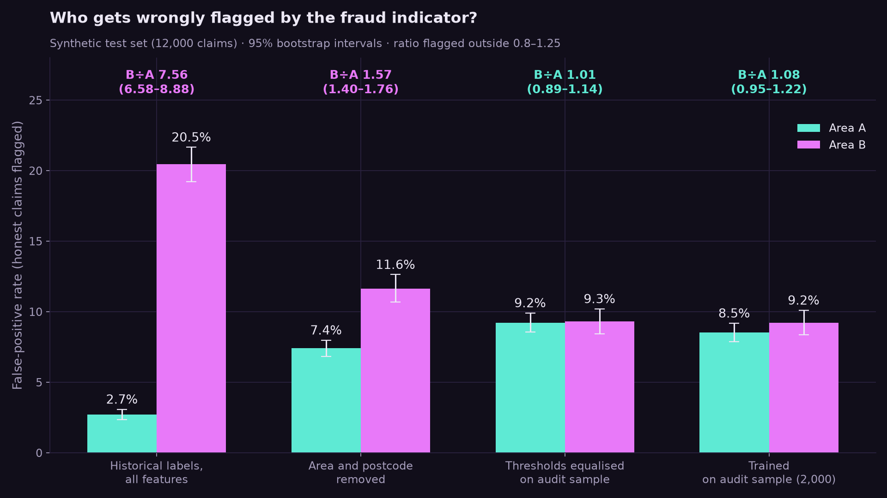
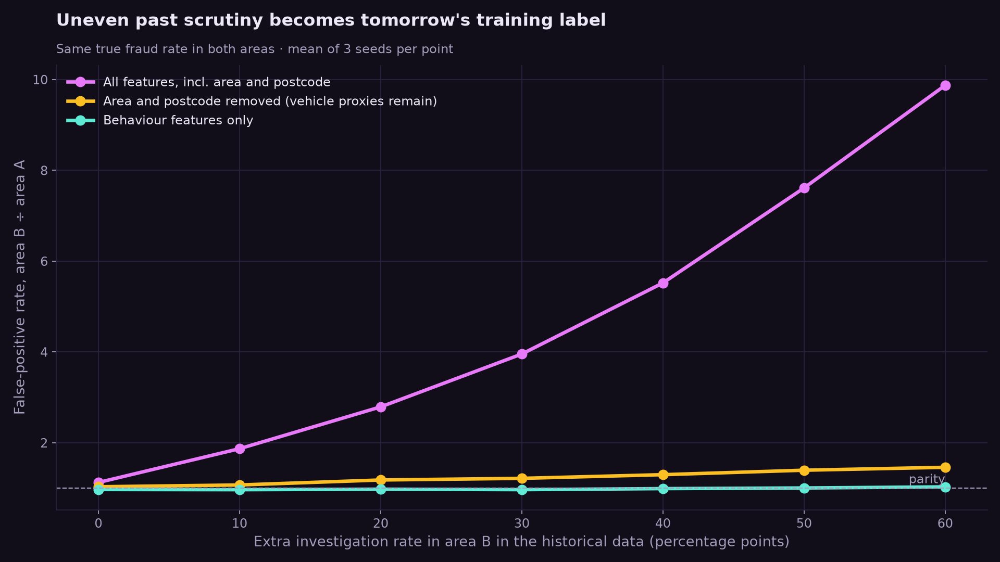
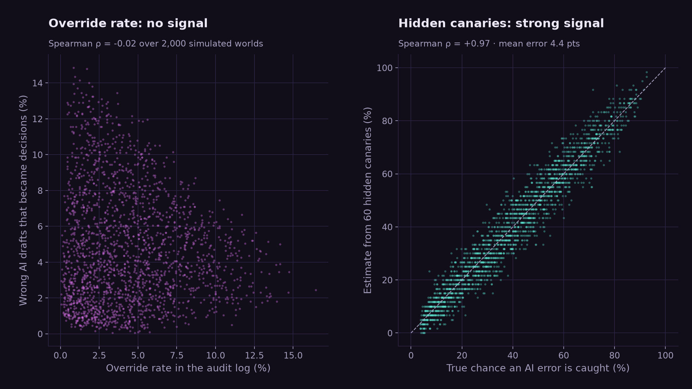
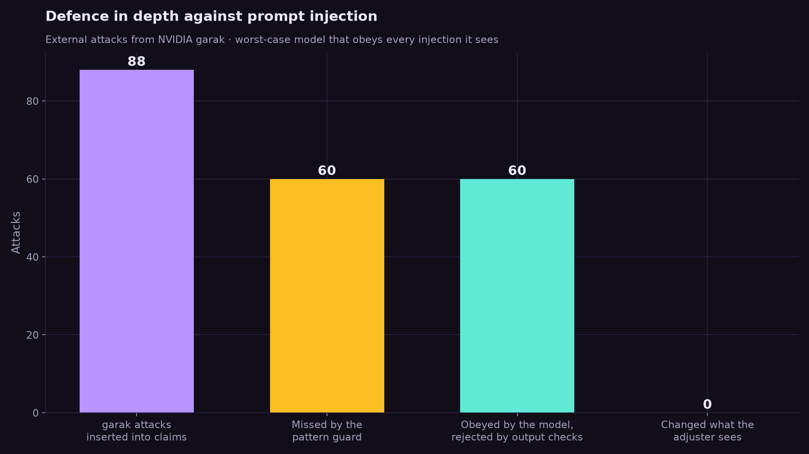
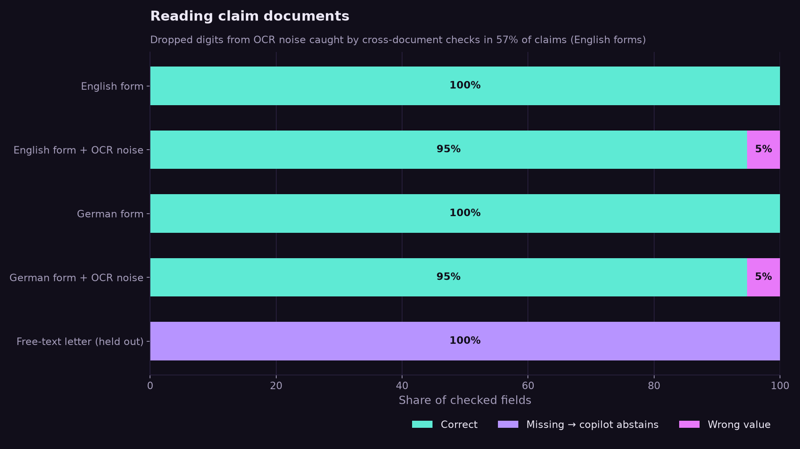
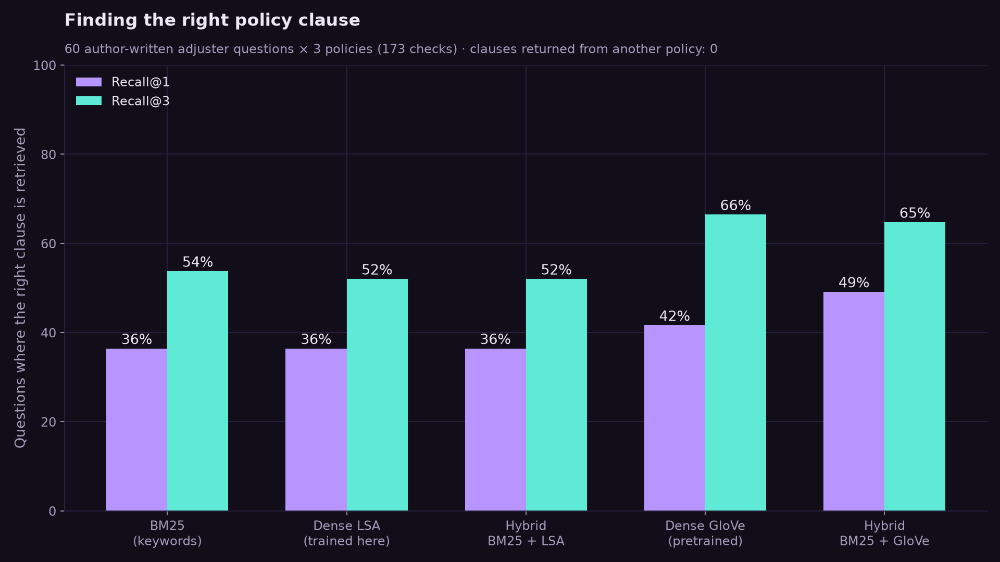
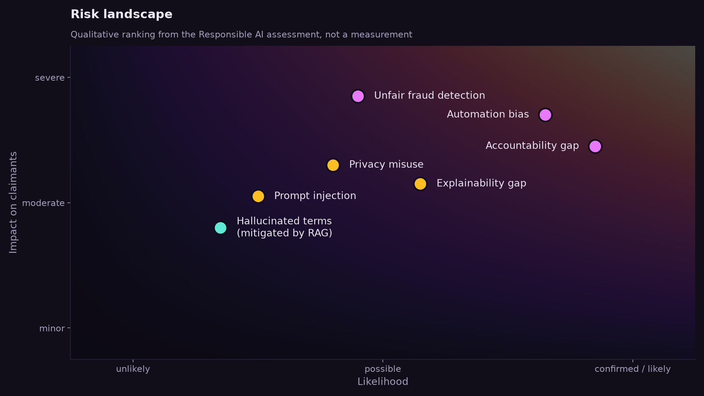

# Claims Copilot: Responsible Generative AI for Motor Insurance

A generative-AI copilot for motor insurance claims handling, a runnable prototype of its
safeguards, an evaluation designed to find where they fail, and a Responsible AI assessment of
whether such a system should be trusted with a real claim.

**The AI never makes the decision.** It drafts; a named, signed-in person decides. In this
prototype that rule is enforced in code, and the evaluation tries to break it.



> **Data notice.** Claims and policies are synthetic, generated by `copilot/synthetic.py`. No
> real claimant, insurer or medical data is used. External inputs: pretrained GloVe word
> vectors and NVIDIA garak's prompt-injection probes. Numbers below describe the prototype on
> this data, not any real claims population.

## Contents

- [The problem](#the-problem)
- [Prototype](#prototype)
- [Evaluation](#evaluation)
- [Limitations](#limitations)
- [Responsible AI assessment](#responsible-ai-assessment)
- [Verdict](#verdict)
- [Run it](#run-it)

## The problem

Every motor claim requires an adjuster to work through police reports, repair estimates,
medical documentation and the policy wording, then draft a rationale largely from scratch. A
generative-AI copilot can draft that work. But claimants and third parties never see the AI and
can't contest how it shaped their outcome, so a system that is faster but less fair, or more
efficient but less accountable, moves risk onto the people least able to see it.

## Prototype

| Module | What it does |
| --- | --- |
| `guard.py` | Treats documents as untrusted input; quarantines lines that try to instruct the model |
| `extraction.py` | Typed, validated fields from English and German forms (OCR confusions normalised); missing or conflicting facts are reported, never guessed |
| `retrieval.py` | Hybrid BM25 + pretrained GloVe retrieval, fused with reciprocal rank fusion, over **only the claimant's own policy** |
| `rules.py` | Deterministic coverage rules: exclusions, excess, settlement cap, medical limit, late notification, escalation |
| `fraud.py`, `fairness.py` | A separate fraud-indicator model and a subgroup audit of its false-positive rates, with bootstrap confidence intervals and a proxy check |
| `drafter.py` | Cited drafts from Claude (`LLMDrafter`) or a deterministic template. Generated drafts must pass output checks: verbatim citations, exactly the clauses that drove the outcome, no changed recommendation, no invented amounts, no other claims, no echoed injected text. A failing draft is replaced, never shown |
| `identity.py`, `workflow.py` | Signed, expiring staff tokens with roles; only an adjuster or supervisor can decide; overrides need a reason; escalated claims need a **different** supervisor; decisions are sealed and only sealed decisions reach the claimant |
| `access.py` | Sensitivity labels (internal, confidential, special-category health data); drafts inherit the highest label of their sources; views are role-filtered and logged |
| `audit.py` | HMAC-keyed hash chain with checkpoints anchored outside the log; back-dated entries rejected |
| `monitoring.py`, `controls.py` | Hidden canary drafts and unannounced re-review measure whether review is real; thresholds open incidents that pause the affected component until the governance function resumes it |

```text
$ python demo.py
=== Draft as the adjuster sees it ===
Recommendation (for the adjuster to decide): approve
- Collision damage is covered less the 500 EUR excess. [BASIC-2.1]
- Medical costs of 6475.83 EUR are covered up to 5000 EUR. [BASIC-6.1]
- Indicative payable amount: 10865.00 EUR.

=== Same draft as a fraud investigator sees it (no health data) ===
- Collision damage is covered less the 500 EUR excess. [BASIC-2.1]
- [withheld: you are not cleared for this information]

Refused (copilot decides alone): A signed staff token is required
Refused (adjuster without supervisor): This claim is escalated and needs supervisor sign-off
```

## Evaluation

`python -m evaluation.run_all` regenerates every number and figure (`results/metrics.json`,
`figures/`, about five minutes). `python -m pytest` runs 43 tests.

### How the evaluation avoids grading its own homework

| Concern | What the evaluation does instead |
| --- | --- |
| Templated documents make extraction trivially perfect | Three document styles, one **held out** from development, plus OCR noise that drops digits |
| Rules checked against the same formula | 14 cases **worked out by hand** from the policy wording, plus property tests (Hypothesis) |
| The audit finds the bias the generator planted | Null controls with unbiased labels, replication across seeds, a hidden-proxy scenario where the obvious fix fails |
| Injection tests written by the same author as the guard | **88 attacks from NVIDIA garak**, never used to tune the guard |
| No real model in the loop | A worst-case fake model that obeys every injection and fails in 7 other ways; a live script for Claude (`evaluation/run_llm.py`) |

### Results

| Stage | Result on synthetic data |
| --- | --- |
| Extraction | 100% of fields correct on clean English and German forms; held-out free-text letters: 0% read, **100% abstained** (no wrong values). With OCR noise, 5% of fields are wrong; cross-document checks catch 57% (English) and 91% (German) of corrupted claims |
| Abstention | All 116 planted conflicts abstained; no abstention on clean claims; **2.5% of shown drafts carry an undetected OCR error** |
| Retrieval | 60 questions × 3 policies: recall@3 BM25 54%, GloVe 66%, hybrid 65%; recall@1 best with hybrid (49% vs 36%); 0 clauses from another policy |
| Rule engine | 14/14 hand-worked cases and both property tests pass |
| Fraud fairness | See below: a hidden-proxy disparity survives the obvious fix |
| Generated drafts | Honest drafts 240/240 accepted; each of 7 failure modes 240/240 rejected |
| Prompt injection | Pattern guard: 100% of known patterns, **11% of garak's**; end to end, 60 attacks reached the model, all 60 were rejected by output checks, **0 changed what the adjuster sees** |
| Audit log | 100% of edits, deletions, reorderings, insertions, rewrites without the key, insider rewrites after a checkpoint and back-dated entries detected; **an insider rewrite with no checkpoint is not** |
| Authority boundary | 11/11 bypass attempts refused, including forged, expired and revoked tokens and a hand-built decision |
| Access control | Health data shown to adjusters, never to investigators or auditors; every view logged |
| Compute | 3 ms CPU per claim; under stated assumptions about 0.006 g CO₂e per 1,000 claims, excluding hosted LLM drafting (no published energy figure) |

### Averages hide unfair flagging, and the obvious fix is not enough

True fraud in the generator is independent of area, but past investigators looked at area B
more often, so more of its fraud was recorded. Area-B vehicles are also older and cheaper.



- Trained on those records with area features, the model flags honest area-B claimants
  **7.6×** as often (95% CI 6.6–8.9).
- **Removing area and postcode is not enough:** vehicle age and value predict area (AUC 0.76),
  and the disparity stays at **1.57×** (CI 1.40–1.76).
- Equalising thresholds on a 2,000-claim audited sample (1.01×) or training on that sample
  (1.08×, with the best accuracy, AUC 0.79) closes the gap. Smaller audit samples (250–1,000)
  gave unstable results.
- **Null controls.** With unbiased labels, the audit flagged 0 of 10 models that cannot see area
  (no false alarms), but 4 of 10 models that use area directly showed a real disparity from
  noise alone: another reason to keep the feature out.
- The audit reports only intervals outside 0.8–1.25. A 0.75× ratio for drivers over 60 on one
  test set did not replicate (0.98× and 0.90× on two other seeds); it was sampling noise, which
  is why the band and replication matter.



### A low override rate proves nothing; canaries do

Across 2,000 simulated worlds drawn from wide parameter ranges (AI error 1–15%, real review
5–100%, catch rate 60–95%), the override rate has **no relationship** with how many wrong drafts
become decisions (Spearman ρ = −0.02). At a 3% override rate, between 0.05% and 13% of
decisions rested on a wrong draft. Sixty hidden canaries estimate the true catch rate closely
(ρ = 0.97), and re-reviewing 100 accepted decisions tracks the harm (ρ = 0.84). This is a
simulation of the monitoring design; real adjusters have to be measured in a pilot.



### Defence in depth against prompt injection

The pattern guard alone missed most external attacks. What held was architecture: the model
only explains the rule engine's outcome, and every generated draft is checked before anyone
sees it.



### Reading documents and finding clauses





## Limitations

- **Synthetic data.** The generator controls ground truth, so it can test mechanisms, not
  real-world rates. `fairness.audit` and `FraudModel` accept any claims with the same fields;
  real validation needs an insurer's audited sample.
- **No live LLM results yet.** The LLM drafter is implemented and tested against a scripted
  fake model. A live run needs an API key: `python -m evaluation.run_llm`.
- **Author-written test questions.** Retrieval questions were written by the author and not
  validated by claims handlers.
- **Guard and checks are not complete.** An injection that subtly biases wording within the
  allowed structure would pass the output checks. A wrong value from OCR that no second
  document confirms reaches 2.5% of drafts; showing the source snippet next to each value would
  help the adjuster catch it.
- **Audit anchors must be frequent.** An insider with the key can rewrite everything after the
  last checkpoint.
- **Identity is simulated.** Tokens stand in for the insurer's single sign-on.

## Responsible AI assessment

### Stakeholders

| Influence over the system | Operate it | Affected by it |
| --- | --- | --- |
| Executive and claims management, AI development team, compliance, DPO, risk management, internal audit | Claims adjusters and supervisors | Claimants and third parties (other driver, witnesses, treating physicians) |

Three tensions run through the assessment: **efficiency vs. fairness**, **fraud prevention vs.
privacy**, and **automation benefit vs. accountability**. In the last one, the adjuster risks
becoming a *moral crumple zone*, formally responsible for a decision they did not originate.

### Ethics: five lenses, one convergence

| Lens | What it surfaces |
| --- | --- |
| Utilitarianism | Efficiency gains are real, but the harm of a false fraud flag and the benefit of speed land on different groups. |
| Deontology | The architecture keeps a human decision-maker, but automation bias can hollow out that duty in practice. |
| Virtue ethics | Design can support practical wisdom under caseload pressure; it cannot manufacture it. |
| UDHR Art. 7, 8, 12 | Non-discrimination (fraud-model bias), effective remedy (explanation mediated twice), privacy (health data in plain-language summaries). |
| Ubuntu | Does the system sustain the insurer–adjuster–claimant relationship, or reduce it to a rubber stamp? |

All five converge on one question: **does the claimant stay visible in the process?**

### Regulation

- **EU AI Act.** Annex III lists life and health insurance risk assessment and pricing as
  high-risk; it does not name motor claims handling, so classification is genuinely open. If
  high-risk, Art. 14(4)(b) (awareness of automation bias) applies directly, and Art. 26 sets
  the deployer's obligations.
- **GDPR.** A DPIA is very likely mandatory (Art. 35); a draft is in [`docs/dpia.md`](docs/dpia.md).
  Art. 22 turns on the CJEU *SCHUFA* test: whether the adjuster's decision "draws strongly
  upon" the AI's draft, which depends on use, not design. Art. 25 (data protection by design
  and by default) anchors the privacy safeguards.

### Risk priorities



1. **Automation bias**, the precondition for several other risks and invisible in the audit log.
2. **Accountability gap**, a structural fact that leaves errors uncorrected.
3. **Unfair fraud detection**, uncertain likelihood but severe harm to the most vulnerable.
4. **Explainability** and **privacy misuse**, the next tier.

### Human-in-the-loop is not human-in-control

The workflow guarantees a human *in the loop*; only evidence from use can show a human *in
control*. The prototype turns that into something measurable (canaries, re-review). The same
problem appears as the **citation-versus-causation gap**: a rationale can cite a real clause
without that clause being why the model recommended what it did. Here the rule engine is the
cause, and the output checks require a generated draft to cite exactly the clauses the rule
engine used.

### Governance

Ownership, a RACI across nine activities, monitoring thresholds and the incident procedure are
in [`docs/governance.md`](docs/governance.md), each linked to the code that enforces it. The
fraud model is documented in [`docs/model-card.md`](docs/model-card.md).

### Path to deployment

1. **Pre-deployment validation**: subgroup fairness testing on an audited sample with pre-set
   pass/fail criteria, a DPIA signed off by the DPO, live LLM evaluation, security testing.
2. **Restricted pilot**: limited adjusters, special-category and fraud-flagged claims excluded,
   canaries from day one.
3. **Limited rollout → full deployment → ongoing monitoring**, each stage earned by evidence.

Review time is a governance control to protect, not a cost to flex against throughput targets.

## Verdict

> A plausible and defensible Responsible AI design, but responsible deployment is not yet
> confirmed until evidence, governance and monitoring requirements are demonstrated.

The legal analysis, the five ethical lenses and the technical risk analysis each reach this
conditional answer independently. The prototype narrows the gap: the authority boundary, audit
log and output checks held under attack, and the monitoring design can measure what the override
rate cannot. What remains is evidence only real operation can give: fairness on real claims,
live model behaviour, and how carefully people actually review.

## Run it

```bash
pip install -r requirements.txt
python demo.py                    # one claim, end to end
python -m pytest                  # 43 tests
python -m evaluation.run_all      # full evaluation, figures and metrics (~5 min, downloads GloVe once)
python -m evaluation.run_llm      # live Claude run; needs ANTHROPIC_API_KEY and costs money
```

## Repository layout

```text
copilot/      pipeline, identity, access control, audit log, monitoring
evaluation/   evaluation stages, red-team fake model, external attacks, figures
tests/        unit, hand-worked and property tests
figures/      generated charts and the architecture diagram
results/      metrics.json from the last evaluation run
docs/         governance, DPIA draft, model card, presentation script
```
